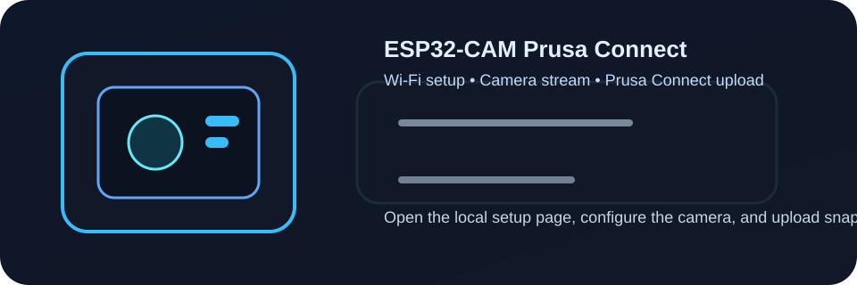

# ESP32-CAM Prusa Connect

[](LICENSE)
[](https://stugre.github.io/ESP32CAM_for_Prusa_Connect/)

ESP-IDF firmware for an AI Thinker-style ESP32-CAM module that uploads snapshots to Prusa Connect.



## Features

- Connects to Wi-Fi, with setup AP fallback on first boot.
- Scans nearby Wi-Fi networks from the setup page and supports blank passwords for open networks.
- Hosts a local web page at the ESP32 IP address and via mDNS at `http://esp32cam.local`.
- Lets you edit Wi-Fi, Prusa Connect token/fingerprint/endpoint, upload interval, resolution, image quality, orientation, and common ESP32 camera sensor options.
- Shows plain-English info buttons for camera setting values such as gain, exposure, white balance, and effects.
- Provides local `/jpg` snapshots and `/stream` MJPEG video.
- Uploads snapshots to Prusa Connect with the Camera API.
- Shows last upload status and supports a manual test upload from the page.
- Provides reboot and factory reset controls from the web page.

## Quick start

1. Install ESP-IDF and activate the environment in your shell.
2. Build and flash with:

```powershell
idf.py set-target esp32
idf.py build
idf.py -p COMx flash monitor
```

Replace `COMx` with your serial port.

## GitHub Pages

A simple project landing page is available in [docs/index.md](docs/index.md). The release notes are also documented in [CHANGELOG.md](CHANGELOG.md).

If you enable GitHub Pages for the `docs/` folder, the site will be published at:

https://stugre.github.io/ESP32CAM_for_Prusa_Connect/

## First boot

On first boot the device starts an access point:

- SSID: `ESP32CAM-Setup`
- Password: `esp32cam`
- Setup page: `http://192.168.4.1`

Enter your Wi-Fi credentials, save, and reboot. The page can scan nearby Wi-Fi networks; leave the password field blank for open networks.

Once connected, the serial monitor prints the assigned IP address. Open that IP in a browser to change settings later, or try:

```text
http://esp32cam.local
```

The web page includes:

- `Save settings` to store Wi-Fi, Prusa Connect, and camera options.
- `Test upload now` to send one snapshot to Prusa Connect and show the result on the page.
- `Snapshot` and `Stream` links for local viewing.
- `Reboot` for applying network changes.
- `Factory reset` to clear stored settings and return to setup mode.

## Prusa Connect setup

In Prusa Connect, add/register a camera for your printer and copy the camera `token` and `fingerprint` into the ESP32 web page. These fields are masked on the settings page.

Default upload endpoint:

```text
https://connect.prusa3d.com/c/snapshot
```

The Prusa Camera API accepts JPG snapshots with `token` and `fingerprint` headers.

The page shows the most recent upload result, including whether it was automatic or manually tested, the HTTP status, and the number of bytes sent when successful.

## Camera settings help

Each camera option has a small `i` info badge. Hover over it to see what the numbers mean, for example:

- `JPEG quality`: lower numbers mean better image quality and larger files.
- `AGC gain`: higher values brighten dark scenes but add more image noise.
- `Gain ceiling`: higher values allow more automatic gain and more noise.
- `Effect`: maps values to normal, negative, black and white, reddish, greenish, blue, and retro.
- `WB mode`: maps values to auto/default, sunny, cloudy, office, and home.

## Camera module

This project uses the common AI Thinker ESP32-CAM pin map:

| Signal | GPIO |
| --- | --- |
| PWDN | 32 |
| RESET | -1 |
| XCLK | 0 |
| SIOD | 26 |
| SIOC | 27 |
| Y9 | 35 |
| Y8 | 34 |
| Y7 | 39 |
| Y6 | 36 |
| Y5 | 21 |
| Y4 | 19 |
| Y3 | 18 |
| Y2 | 5 |
| VSYNC | 25 |
| HREF | 23 |
| PCLK | 22 |

If your board is different, edit the pin constants near the top of [main/main.c](main/main.c).
